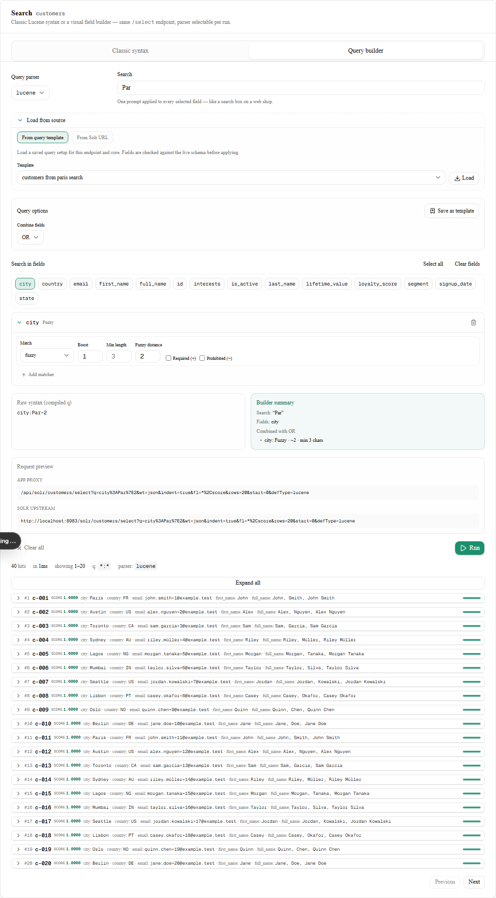
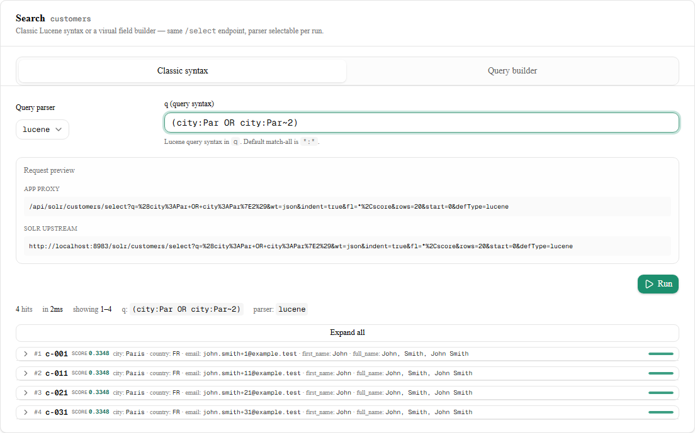
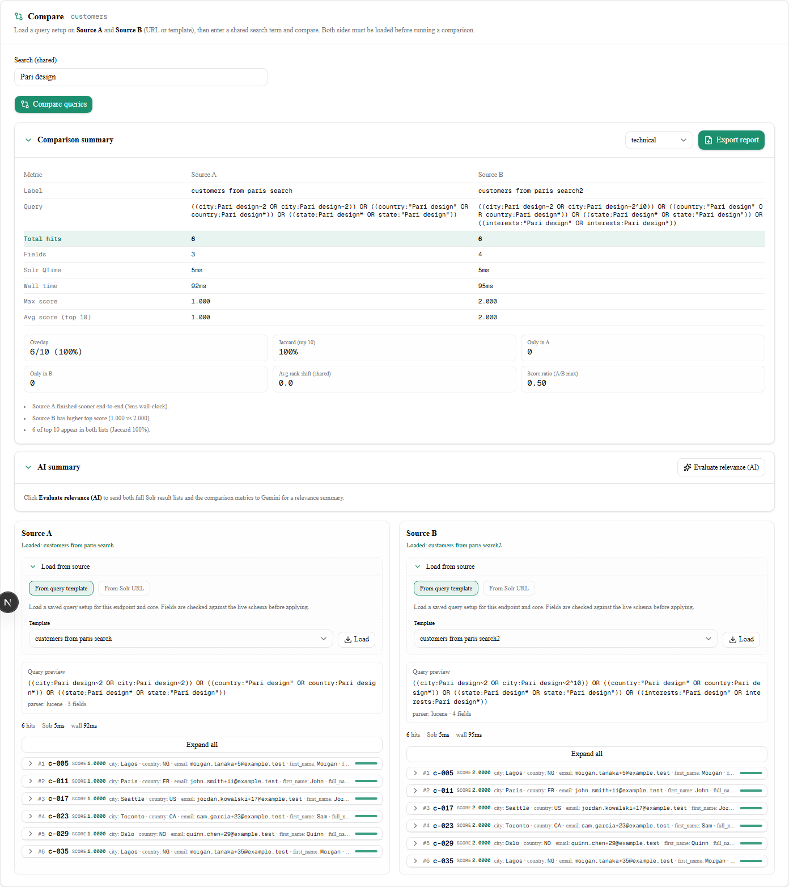
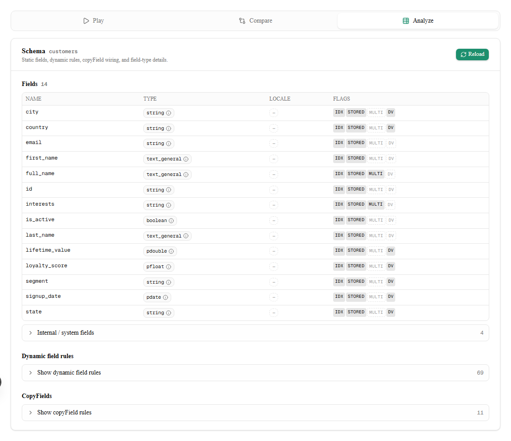
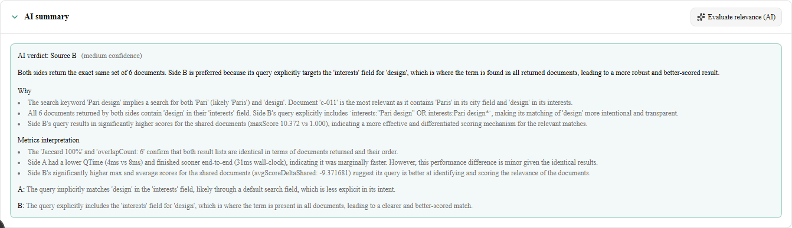
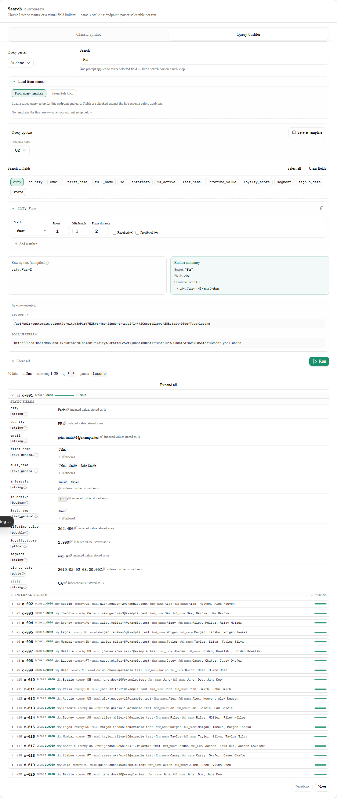
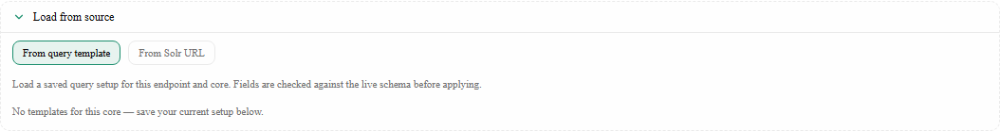
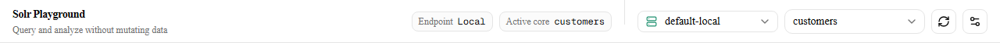

# Solr Playground

[](https://github.com/george-sabau/solr-playground/actions/workflows/ci.yml)

Sidecar UI for **Apache Solr** — query and analysis only (no data mutations). Stack: Next.js, Tailwind, Shadcn UI, Zustand.

See [`.cursor-master-plan.md`](.cursor-master-plan.md) for the roadmap and change history.

## Features overview

The app is a single page at `/` with three top-level tabs: **Play**, **Compare**, and **Analyze**. Solr requests go through a Next.js proxy at `/api/solr/[...path]` so the browser never talks to Solr directly (no CORS setup required for local dev).

| Tab | Sub-areas | Highlights |
| --- | --------- | ---------- |
| **Play** | Query builder (default) · Classic syntax | Lucene / edismax / dismax parsers; optional **filter query** (`fq`) and **boost query** (`bq`); dual **request preview** (app proxy + upstream Solr URL); 20-row pagination; expandable hits with **live indexed-token analysis** via `/analysis/field` |
| **Compare** | Source A · Source B | Load from Solr URL or saved template; shared search term; top-10 side-by-side results; collapsible **Comparison summary** (deterministic metrics); optional **AI summary** via Gemini (`GEMINI_API_KEY` in `.env.local`) |
| **Analyze** | Schema panel | Static fields, dynamic rules, copyFields, internal fields; field-type popover with analyzer chain; Reload |

The local Docker showcase ships two cores — **`customers`** and **`products`** — with seed data in [`solr/data/`](solr/data/). See [`solr/README.md`](solr/README.md) for Solr-only setup and re-indexing.

## Preview

Visual sidecar for Solr query and analysis — build searches, compare two setups, inspect schema, switch endpoints and cores.



| Play (builder) | Play (classic) | Compare | Analyze |
| :---: | :---: | :---: | :---: |
|  |  |  |  |
| Field matchers, fuzzy mode, Run + hits | Raw `q`, parser, request preview | Templates **customers from paris search** / **search2**, shared term `Pari design`, comparison + AI button | Field types, flags, dynamic rules, copyFields |

| Compare (AI evaluation) | Results (expanded) | Load from source | Connection header |
| :---: | :---: | :---: | :---: |
|  |  |  |  |
| After **Evaluate relevance (AI)** on the same template pair | Score bar, field groups, indexed analysis | Template picker + Solr URL import | Endpoint/core switcher, refresh cores |

**Regenerate screenshots** (Playwright; needs Solr + app on :3000):

```bash
npm run dev:stack                    # separate terminal, leave running
npx playwright install chromium      # once, after npm install
npm run screenshots
```

Output goes to [`docs/screenshots/`](docs/screenshots/) (8 PNGs). The **Compare** captures load templates **customers from paris search** (Source A) and **customers from paris search2** (Source B), run a shared search for **`Pari design`**, and show the comparison summary plus **Evaluate relevance (AI)**. Templates are created automatically if missing. **compare-ai-summary** calls Gemini and needs a saved `GEMINI_API_KEY` in `.env.local`. Override the app URL with `APP_URL=http://localhost:3000` if needed. See [`scripts/capture-screenshots.mjs`](scripts/capture-screenshots.mjs) for the capture flow.

## Continuous integration

Every push and pull request to `main` runs [GitHub Actions](.github/workflows/ci.yml) with five parallel jobs:

| Check | Command |
| ----- | ------- |
| lint | `npm run lint` |
| typecheck | `npm run typecheck` |
| test | `npm run test` (query logic, **template persistence**, compare AI payload) |
| build | `npm run build` |
| db-migrate | `DATABASE_PATH=:memory: npm run db:migrate` |

Run the same checks locally before pushing:

```bash
npm run lint && npm run typecheck && npm run test && npm run build
$env:DATABASE_PATH=":memory:"; npm run db:migrate   # PowerShell
# DATABASE_PATH=:memory: npm run db:migrate         # bash
```

Solr, Docker, and Playwright screenshot flows are **not** part of CI (local/dev only).

After the workflow is green on `main`, you can require these checks under **Settings → Branches → Branch protection rules**.

## Prerequisites

- Node.js **22.x** (matches CI; see [`engines`](package.json) and [`.nvmrc`](.nvmrc) — use `nvm use` or `fnm use` before `npm install`)
- Docker Desktop (or Docker Engine + Compose v2) for the local Solr showcase

## Recommended: Solr + app in one command

From the **repository root** (after `npm install` once):

```bash
npm run dev:stack
```

This runs **Solr in Docker** (detached) on port **8983**, then starts the **Next.js dev server** on **http://localhost:3000**. Leave this terminal open; press **Ctrl+C** to stop Next.js only (Solr keeps running in Docker).

Stop **both** Solr and anything bound to the app port:

```bash
npm run stop:stack
```

That runs `docker compose … down` for the Solr service and runs **`kill-port` on port 3000**, which frees port 3000 even if a stray `next dev` is still running. If something else important is listening on 3000, stop it manually instead.

### Docker not found on Windows (`Der Befehl "docker" ist ...`)

`dev:stack` / `stop:stack` use Node scripts that look for **`docker` on PATH**, run **`where.exe docker`** on Windows, then try common **`docker.exe`** install locations. Detection uses **`docker --version`** (works without a running engine). If it still fails:

1. Install/start **Docker Desktop**.
2. **Restart Cursor** (or open a new terminal) so PATH includes Docker.
3. Or set **`DOCKER_EXE`** to the full path of `docker.exe`, then run `npm run dev:stack` again (PowerShell):

   ```powershell
   $env:DOCKER_EXE = "C:\Program Files\Docker\Docker\resources\bin\docker.exe"
   npm run dev:stack
   ```

## Manual two-step workflow

1. **Solr:** `cd solr && docker compose up -d` (see [`solr/README.md`](solr/README.md))
2. **App:** `npm run dev`

Default Solr base URL in the UI: `http://localhost:8983/solr`.

## Play tab

**Query builder** is the default sub-tab; switch to **Classic syntax** for raw Lucene `q` strings.

### Query builder

- **Search** — one prompt applied to every selected field.
- **Load from source** — import a saved template or reverse-engineer a Solr select URL (schema-validated).
- **Query options** — combine fields with AND/OR; optional **Filter query** (`fq`) to restrict results (e.g. `is_active:true`, with a true/false dropdown for boolean fields); optional **Boost query** (`bq`) to raise scores for a field match (e.g. `interests:design^10`).
- **Field chips** — toggle indexed fields; configure matchers per field (term, phrase, exact, wildcard, prefix, fuzzy), numeric boost, min length, required (+) / prohibited (−); multiple matchers on one field are OR’d.
- **Parser** — lucene, edismax, or dismax; edismax exposes mm, min, tie, and qf (auto from selected fields or manual override).
- **Save as template** — persist matchers, search text, edismax options, and filter/boost settings for the active endpoint + core (see [Query templates](#query-templates)).
- **Request preview** — shows both the app proxy URL and the upstream Solr URL (including `fq` / `bq` when set) before you run.

### Classic syntax

Raw `q` string, parser selection, edismax block when applicable, and the same request preview.

### Results

After **Run**, the hit bar shows total hits, Solr QTime, row range, committed `q`, and parser. Results paginate 20 rows per page (Previous / Next). Each hit expands to show static, dynamic, and internal field groups with persisted values; expanding a field row fetches **indexed** token analysis from Solr on demand. **Expand all** / **Collapse all** controls are available when hits are present.

## Solr endpoints (connection)

The header **endpoint** dropdown lists saved Solr base URLs (default: **Local** → `http://localhost:8983/solr`). On wide screens, chips show the active endpoint label and core name.

- **Manage endpoints…** or the gear icon — add, edit, or remove connections; optional labels; per-endpoint Basic auth; **Test connection**; duplicate-URL warning.
- **Core switcher** — pick a core; **Refresh cores** re-fetches `/admin/cores?action=STATUS`.
- The last selected **core** is remembered per endpoint.

Settings are stored in a **local SQLite database** on the machine running the app (not in the browser). On first load after an upgrade, existing `localStorage` data is migrated once into the database via `/api/presets/migrate-local`.

### Local database

| Variable | Default | Purpose |
| -------- | ------- | ------- |
| `DATABASE_PATH` | `.data/solr-playground.db` (under the repo) | SQLite file path |
| `SOLR_PLAYGROUND_SECRET` | *(dev fallback)* | AES-256-GCM key material for encrypted Basic auth passwords |

Set `SOLR_PLAYGROUND_SECRET` to a long random string in production so endpoint passwords are not encrypted with the built-in dev fallback.

Apply schema manually (also runs automatically when the app opens the DB):

```bash
npm run db:migrate
```

If `db:migrate`, template load, or connection save fails with `NODE_MODULE_VERSION` / `better_sqlite3.node`, your **Node version changed since `npm install`** (common after upgrading to Node 24). Templates and endpoints live in `.data/solr-playground.db` — the data is not deleted; SQLite simply cannot open until the native module matches your Node runtime.

Fix:

```bash
node -v                  # should be 22.x for this project
nvm use                  # or fnm use — reads .nvmrc
npm rebuild better-sqlite3
# if still failing:
npm ci
```

(`postinstall` runs `npm rebuild better-sqlite3` automatically after `npm install`.)

`npm run dev:stack` runs a preflight check and prints these instructions if the module fails to load.

The database includes a **sqlite-vec** `embedding_chunks` virtual table (`float[384]`) as a stub for future semantic search; the app does not write embeddings yet.

Tables: `solr_endpoints` (URLs, labels, encrypted auth, `last_core`), `query_builder_templates`, `app_settings` (active endpoint id). Schema definitions: [`src/lib/persistence/schema.ts`](src/lib/persistence/schema.ts) and [`src/lib/persistence/migrate-runner.mjs`](src/lib/persistence/migrate-runner.mjs).

#### Browse the DB in Cursor

This repo recommends the **[SQLite Viewer](https://marketplace.visualstudio.com/items?itemName=qwtel.sqlite-viewer)** extension (`qwtel.sqlite-viewer`). Cursor should prompt to install it when you open the workspace (see [`.vscode/extensions.json`](.vscode/extensions.json)).

1. **Extensions** (`Ctrl+Shift+X`) → search **SQLite Viewer** → Install (publisher: Florian Klampfer).
2. Open [`.data/solr-playground.db`](.data/solr-playground.db) (create it first with `npm run dev:stack` or `npm run db:migrate`).
3. Use the table list in the editor to browse `solr_endpoints`, `app_settings`, etc. Run SQL from the viewer when needed.

If the file opens as gibberish text, close it and use the Command Palette (`Ctrl+Shift+P`) → **SQLite Viewer: Open Database** → pick `.data/solr-playground.db`.

## Query templates

On the **Query builder** tab, **Save as template** stores the current parser, field matchers, search text, edismax options, and optional filter/boost queries for the active **endpoint** and **core**. Template names must be unique per endpoint+core pair (duplicate saves return an error).

**Load from source** (collapsible) offers two paths (template first by default):

- **From query template** — pick a saved template scoped to the current endpoint and core; switching cores (e.g. `customers` → `products`) shows a different list.
- **From Solr URL** — reverse-import field matchers, search text, parser, edismax settings, and a single `fq` / `bq` when present; field names are validated against the live schema before applying.

Templates live in the `query_builder_templates` table (migration v2). Manage or delete saved names from the save dialog.

## Compare tab

The **Compare** tab runs two query setups side by side against the same core and endpoint:

1. **Source A** and **Source B** — each has **Load from source** (Solr URL or saved template), same as Query builder. Both must be loaded before comparing. The README preview uses templates **customers from paris search** (A) and **customers from paris search2** (B) with shared search **`Pari design`**.
2. **Search (shared)** — one search box; both plans use this text when you click **Compare queries** (Enter runs compare when ready).
3. **Comparison summary** (collapsible) — table with Solr QTime, wall-clock time, total hits, max/avg scores; chips for overlap, Jaccard, only-in-A/B, avg rank shift, score ratio; neutral hint bullets.
4. **Top 10** results per side (same expandable `ResultDoc` list as Play, including field analysis).
5. **AI summary** (collapsible, below) — optional Gemini evaluation via **Evaluate relevance (AI)**. Sends both full Solr `/select` response bodies (top 10) plus deterministic comparison metrics to Gemini; returns a verdict, confidence, narrative summary, reasons, metrics interpretation, and per-side notes.

When no API key is configured, the AI button stays disabled and shows setup instructions — deterministic compare still works without AI.

### AI relevancy evaluation (optional, Gemini)

Copy [`.env.example`](.env.example) to `.env.local`, set your key from [Google AI Studio](https://aistudio.google.com/apikey), and **save the file** (Next.js reads from disk, not an unsaved editor buffer). Restart the dev server after changing env vars.

| Variable | Purpose |
| -------- | ------- |
| `GEMINI_API_KEY` | Google AI Studio API key for **Evaluate relevance (AI)** |
| `COMPARE_AI_API_KEY` | Alternative key name (fallback if `GEMINI_API_KEY` is unset) |
| `COMPARE_AI_MODEL` | Gemini model id (default `gemini-2.5-flash`) |

`GET /api/compare/evaluate` reports whether a key is configured (`{ "available": true }`). The **Evaluate relevance (AI)** button also requires **both Source A and Source B to return at least one hit** after **Compare queries** — use a shared search term that matches on both sides (e.g. **`Pari design`** with Paris/design field templates on the `customers` core).

**Evaluate relevance (AI)** calls `POST /api/compare/evaluate` with both response bodies and metrics. The **AI summary** panel shows the Gemini verdict (`a`, `b`, or `tie`), confidence, summary, reasons, metrics interpretation, per-side notes, and caveats.

Implementation lives in [`src/lib/ai/compare/`](src/lib/ai/compare/) (config, payload builder, Gemini provider, evaluator).

## Analyze tab

Fetches schema from Solr admin APIs (fields, dynamic fields, field types, copyFields).

- **Fields table** — name, type badge (click for analyzer chain popover), locale derived from type name, indexed/stored/docValues/multiValued flags.
- **Dynamic rules** — nested expandable groups.
- **CopyFields** — source → destination rules.
- **Internal / system fields** — collapsible section.
- **Reload** — re-fetch schema for the active core.

## API routes

Server routes under [`src/app/api/`](src/app/api/) (for contributors):

| Route | Methods | Purpose |
| ----- | ------- | ------- |
| `/api/solr/[...path]` | GET, POST | Solr proxy; client sends `x-solr-base-url` and optional `x-solr-auth` (Basic) |
| `/api/presets/connections` | GET, PUT | Load/save endpoint list + active endpoint id |
| `/api/presets/templates` | GET, POST | List/create templates (`endpointId`, `core` query params on GET) |
| `/api/presets/templates/[id]` | GET, DELETE | Fetch or delete a single template |
| `/api/presets/migrate-local` | POST | One-time `localStorage` → SQLite migration |
| `/api/compare/evaluate` | GET, POST | AI availability check + relevance evaluation |

## Regenerate seed JSON

```bash
npm run seed:solr
```

Then follow [`solr/README.md`](solr/README.md) if you need a full re-index.

## Scripts

| Command | Description |
| ------- | ----------- |
| `npm run dev:stack` | Node launcher: find `docker`, Compose up Solr, then `next dev` |
| `npm run stop:stack` | Node launcher: Compose down + kill port **3000** |
| `npm run dev` | Next.js only (Solr must already be running) |
| `npm run start` | Production server (after `npm run build`) |
| `npm run db:migrate` | Create/update SQLite schema (WAL + sqlite-vec) |
| `npm run seed:solr` | Rewrite `solr/data/*.json` |
| `npm run build` | Production build |
| `npm run lint` | ESLint (Next.js core-web-vitals + TypeScript) |
| `npm run typecheck` | `tsc --noEmit` |
| `npm run test` | Vitest unit tests (`src/**/*.test.ts`, incl. query templates + SQLite persistence) |
| `npm run test:watch` | Vitest in watch mode |
| `npm run screenshots` | Regenerate README preview PNGs (requires `dev:stack` + Chromium; see [Preview](#preview)) |

## License

Apache Solr and bundled Solr config derive from the Apache License 2.0 where applicable. Application code: see repository license if present.
